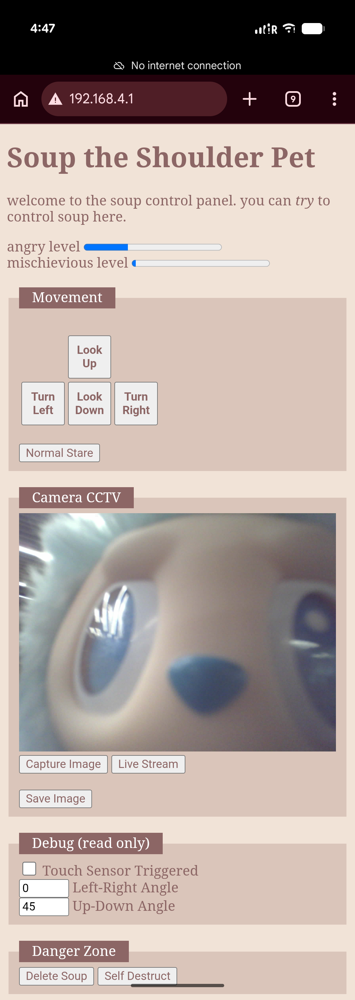
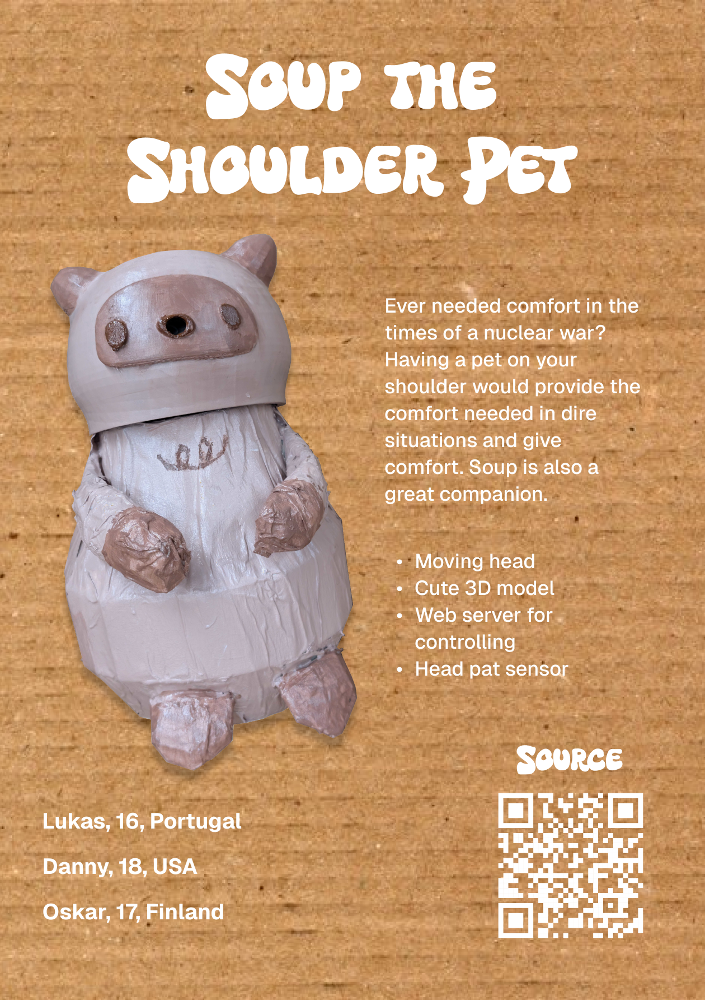

# Soup: The shoulder pet

by the LDO team

This project was created for the in person at the 7-day Fallout hackathon in Shenzhen, China. It was ran by Hack Club. The project was inspired by how pikachu sits on Ash's shoulder in the Pokémon animated series. Soup is the mascot of the Fallout hackathon so we thought it would be cool to stay on theme and try to make a robot that replicates the feeling and look of having a friend like Pikachu on your shoulder.

## Purpose

Ever needed comfort in the times of a nuclear war? Having a pet on your shoulder would provide the comfort needed in dire situations and give comfort. Soup is also a great companion. 

## Features

- Moving head
- Cute 3D model
- Web server for controlling
- Head pat sensor

## 3D model

The main Soup model was created in Blender and the parts on the inside were finished in Fusion. The cad files attached are pretty simple and have stuff like the servos just floating and not attached to the main body. 

The CAD was made more as a reference and made so we could get all the 3D printed parts instead of it being a fully completed design. The inside of soup including attaching the servos and head etc. were made with just cardboard and hot glue because it was fast and good enough for a Hackathon project. You can find the full project files as a Fusion assembly in the [`./3D/Cad/`](./3D/Cad/) folder. It's available as a .f3z and a .step file. 

The body can be 3d printed but because of the size it will take a long time. The build that is visible here has the body made out of cardboard and painters tape

## Firmware

The firmware for the Seeed XIAO ESP32-S3 sense is written using platformio on arduino platform.

An AP (access point) is setup which allows you to connect to wifi generated by the mcu. It then gives access to a web control panel to remote control Soup. Things like movement, events, and sensor outputs can be viewed on the dashboard.

Libraries In Use

 * esp32async/ESPAsyncWebServer@^3.11.2 (webhooks, communication between mcu and mobile devices)
 * arkhipenko/TaskScheduler@^4.0.8 (event handling/scheduling)
 * madhephaestus/ESP32Servo@^3.2.1 (controlling servos for the head)
 * espressif/esp32-camera@^2.0.4 (interface for the camera)

## Zine page 

The Zine page is also available as a pdf [`zine.pdf`](zine.pdf).

## Build instructions

### 3d printing the parts

For 3d printing the parts you will have to print the servo holder, the head and the body as seperate parts. The head and the body are long prints and you should print them with supports as they have overhangs that will fail without them. The servo holders have to be printed in three pieces check the [`./3D/Print`](./3D/Print/) folder that has all the ready to print files in .stl format. 

### Optional: Making the body with cardboard

If you don't want to print the body you can make it out of cardboard and tape. We first cut slots into a piece of card board to make it easier to bend. Then eventually. You will cut down the width of the cardboard parts until you have almost a ball of cardboard. We used around 6 layers of cardboard and wrapped tape around everything. The ball will be the main body

After making the ball for the main body you can make a slightly longer cylinder in cardboard you can attach and wrap with tape to make the neck. The hands and tail are just a bit of paper that has a lot of tape wrapped around them. Keeping the ends inside the main cylinder will make the outer body look cleaner. They are attached with hot glue and the hands have some tape over them that is wrapped around the whole body.

### Testing the electronics

You should flash the files in the [`/firmware`](./firmware/) folder to your Seeed XIAO ESP32-S3 Sense. You can connect it to a bread board along with your servos. You can see the wiring diagram for how things are wired. When you give the Xiao power you there should be a wifi hotspot you can connect to called Souppp. After connecting you can open the website at [`192.168.41`](http://192.168.41). The website lets you control all the actions of Soup.

After testing everything on the breadboard you can move onto the next step.

### Painting the body and head

For painting we used brown and white acrylic paint. We mixed them together to get the three shades of brown we needed. The light brown for most of the body, the slightly darker brown for the arms, legs, ears and face. Then finally a dark brown for the eyes, nose and some details. For our build we did a total of 4 coats of paint.

1. The whole body and head painted with the light brown. (2 coats)
2. Use the slightly darker brown to color in the details for the arms, legs, ears and face. (1 coat)
3. Finish off with the eyes and nose with the darkest brown. You can also add the details on the 

### Assembling Soup

After painting the parts and verifying the electronics you can start with assembly. The CAD files have no real attachment points and the design does expect most parts to be attached to one another using hot glue and cardboard. You should try to align the servo motors to the center of the body and head. The touch sensor was attached to the inside of soups head with hot glue and it can be triggered through the 3d print. The Xiao can be attached with hot glue as well but because of the camera sensor it can be a little bit risky. You can also just use tape to attach it. The xiao will be attached inside Soups head so that the camera sensor points out of soups nose. 

The servos go inside their holders and the arm will be placed onto the top servo. You can see the referance picture below. The servo stack can be attached to the body and head using pieces of cardboard stack together and hot glued from the sides of the body to the servo holder on the stack.

## Making the mount

## bom

|Part                     |Description      |Quantity|
|-------------------------|-----------------|--------|
|Seeed XIAO ESP32-S3 Sense|microcontroller  |1       |
|SG90 Servo               |for rotation axis|2       |
|Touch Sensor             |                 |1       |
|Jumper Cables            |                 |a lot   |
|Painters tape            |                 |too much|
|Cardboard                |                 |a lot   |

`soup`

